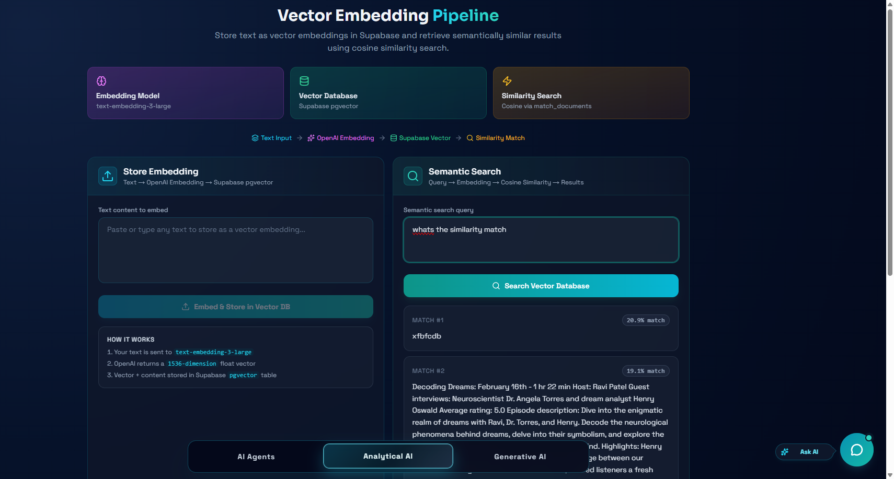

# AI Studio — Frontend

A modern Next.js 14 web app that brings three powerful AI experiences into one
clean interface: **Autonomous AI Agents**, **Analytical AI (Vector Search)**,
and a **Real-Time Voice Assistant**.

**Live Demo**:
[tm-ai-studio.me](https://www.tm-ai-studio.me/) ·
[ai-studio.tarekmonowar.dev](https://ai-studio.tarekmonowar.dev/) ·
[ai-studio-tm.vercel.app](https://ai-studio-tm.vercel.app/)

**Repositories**:

- Frontend: [Ai-Studio-FrontEnd](https://github.com/tarekmonowar/Ai-Studio-FrontEnd)
- Backend: [Ai-Studio-BackEnd](https://github.com/tarekmonowar/Ai-Studio-BackEnd)

---

## What This Project Solves

AI Studio shows how AI can move beyond simple chat and actually **do work
inside a real application**. Users can talk or type to the assistant, and it
will perform real actions — navigate pages, send emails, change the site's
look, search through stored knowledge, or hold a live voice conversation.

In short, the app turns natural language into real, useful outcomes.

---

## Feature 1 — Autonomous AI Agents


The home page is a chat panel where the AI agent listens to your instructions
and uses **GPT function calling** to run real actions on the app and server.

What the agent can do:

- **Navigate Pages** — say "go to analytical AI" and it routes you there.
- **Send Real Emails** — it asks for the missing details (to, subject, body),
  validates them, and triggers the backend SMTP pipeline through Nodemailer.
- **Customize the UI Live** — change theme, primary color, background, or
  font size on the fly. Example: "make the theme dark and use orange accents".
- **Smart Clarification** — if a request is missing info, the agent will
  politely ask for it instead of failing.

Every step is shown live in the side **AI Pipeline Monitor** so you can see
how user prompt → GPT → tool call → action plays out.

---

## Feature 2 — Analytical AI (Vector Search)



The `/analytical-ai` page is a complete **vector embedding pipeline** built
with OpenAI embeddings and Supabase `pgvector`.

It solves a simple but powerful problem: **how do you let a computer find
text by meaning, not by exact words?**

Two panels work together:

- **Store Panel** — paste any text, click *Embed & Store*. The app sends it
  to `text-embedding-3-large`, gets back a 1536-dimension vector, and saves
  the text + vector inside a Supabase `pgvector` table.
- **Search Panel** — type a question or topic. The app embeds the query the
  same way and uses Supabase's `match_documents` RPC (cosine similarity) to
  return the closest results, ranked by a similarity percentage.

Why this is useful:

- Search by **meaning** ("payment issues" can match "billing problems").
- Acts as the foundation for **RAG** (Retrieval-Augmented Generation),
  knowledge bases, smart FAQ tools, and document Q&A.
- Shows the full flow visually: *Text → Embedding → Vector DB → Match*.

---

## Feature 3 — Generative AI Voice Assistant

The `/generative-ai` page is a **real-time voice assistant** powered by
Azure Voice Live. Tap the mic and have a natural spoken conversation:

- Practice **interview questions** across topics like JavaScript, React,
  Node.js, MongoDB, Docker, and more.
- Train **spoken English** with live feedback.
- Server-side voice activity detection (VAD), echo cancellation, and noise
  suppression for clean audio.

---

## Tech Stack

- **Framework**: Next.js 14 (App Router)
- **Language**: TypeScript
- **Styling**: Tailwind CSS
- **Icons**: Lucide React
- **Markdown**: react-markdown + remark-gfm
- **Realtime**: Native WebSocket + Web Audio API for the voice page

---

## Getting Started

1. **Clone the repository**

   ```bash
   git clone https://github.com/tarekmonowar/Ai-Studio-FrontEnd.git
   cd frontend
   ```

2. **Install dependencies**

   ```bash
   npm install
   ```

3. **Set up environment variables** — create a `.env.local` file:

   ```env
   NEXT_PUBLIC_BACKEND_HTTP_URL=http://localhost:8787
   # Optional: override the WebSocket URL for the voice feature
   # NEXT_PUBLIC_BACKEND_WS_URL=ws://localhost:8787/ws
   ```

4. **Run the development server**

   ```bash
   npm run dev
   ```

   Open [http://localhost:3000](http://localhost:3000) in your browser.

---

## Project Structure (high level)

```
src/
├── app/
│   ├── page.tsx                  → AI Agents (home)
│   ├── analytical-ai/page.tsx    → Vector embedding pipeline
│   └── generative-ai/page.tsx    → Real-time voice assistant
├── components/
│   ├── ai-agents/                → Chat, pipeline monitor, controller hook
│   ├── analytical-ai/            → Store + Semantic search panels
│   ├── ai-generative/            → Voice orb, transcript, controls
│   └── ai-messenger/             → Floating chat messenger
└── public/                       → Images & icons
```

---

_For API keys, the email service, and all server logic, see the
[Backend Repository](https://github.com/tarekmonowar/Ai-Studio-BackEnd)._
