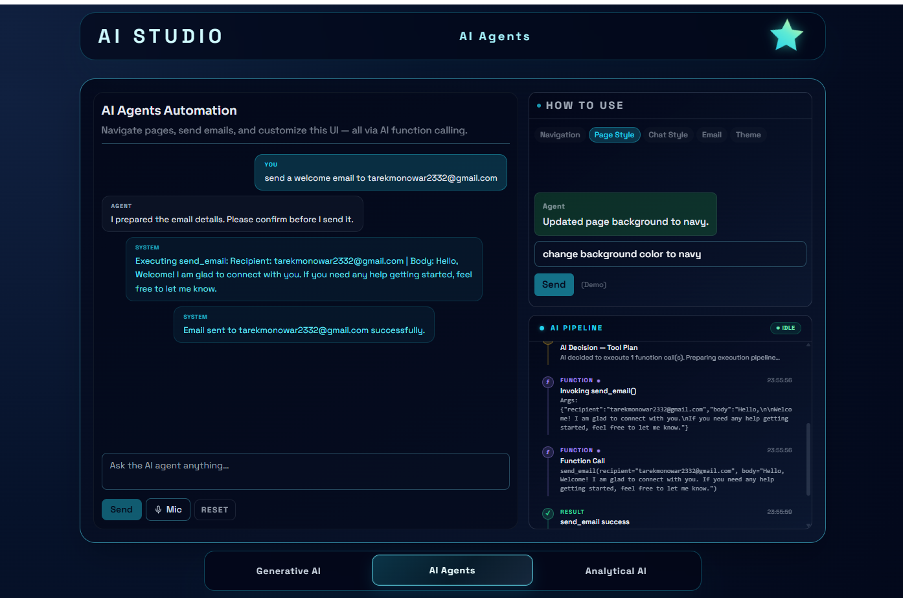
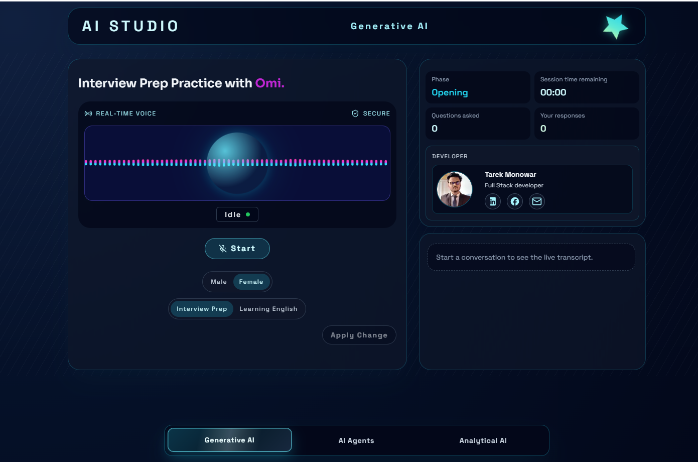

# 🎙️ AI Studio - Frontend

**Live Demo**:
[https://ai-studio.tarekmonowar.dev/](https://ai-studio.tarekmonowar.dev/) |
[https://ai-studio-tm.vercel.app/](https://ai-studio-tm.vercel.app/)

**GitHub Repositories**:

- Frontend:
  [https://github.com/tarekmonowar/Ai-Studio-FrontEnd](https://github.com/tarekmonowar/Ai-Studio-FrontEnd)
- Backend:
  [https://github.com/tarekmonowar/Ai-Studio-BackEnd](https://github.com/tarekmonowar/Ai-Studio-BackEnd)



## 📖 What This Project Solves

AI Studio is an interactive, real-time voice assistant explicitly designed for
technical mock interviews. It allows users to practice real-world interview
scenarios seamlessly. By combining cutting-edge Voice Activity Detection (VAD)
and WebSocket streaming, the frontend provides an extremely responsive and
natural conversational interface for candidates to practice and improve their
skills.

## ✨ Features

- **Real-time Voice Interaction**: Seamless microphone capture, WebSockets
  streaming, and audio playback.
- **Voice Activity Detection (VAD)**: Smartly detects when the user starts/stops
  speaking for fluid turn-taking.
- **Interactive UI**: Clean, modern interface built with Next.js 14 and Tailwind
  CSS.
- **Real-time Transcripts**: Displays the conversation transcript dynamically as
  you speak.

## 🛠️ Tech Stack

- **Framework**: Next.js 14 (App Router)
- **Styling**: Tailwind CSS
- **Icons**: Lucide React
- **Voice / Audio**: Custom Hooks (`useMicrophoneVad`, `useVoiceSocket`), PCM
  Processing

## 🚀 Getting Started

1. **Clone the repository**:

   ```bash
   git clone https://github.com/tarekmonowar/Ai-Studio-FrontEnd.git
   cd frontend
   ```

2. **Install Dependencies**:

   ```bash
   npm install
   ```

3. **Set up Environment Variables**: Create a `.env.local` file with your
   backend connection URLs:

   ```env
   NEXT_PUBLIC_BACKEND_HTTP_URL=http://localhost:8787
   NEXT_PUBLIC_BACKEND_WS_URL=ws://localhost:8787/ws
   ```

4. **Run the Development Server**:
   ```bash
   npm run dev
   ```
   Open [http://localhost:3000](http://localhost:3000) to view it in the
   browser.

---

_For the backend logic, API keys, and voice AI integrations, check out the
[Backend Repository](https://github.com/tarekmonowar/Ai-Studio-BackEnd)._

## 🧠 Generative AI Capabilities



Beyond just voice agents, the application features a robust **Generative AI** interface. Here you can explore deep analytical insights, ask dynamic technical questions, handle complex tasks, and experience a state-of-the-art interface built on top of modern Large Language Models perfectly matched for coding and logic execution.
